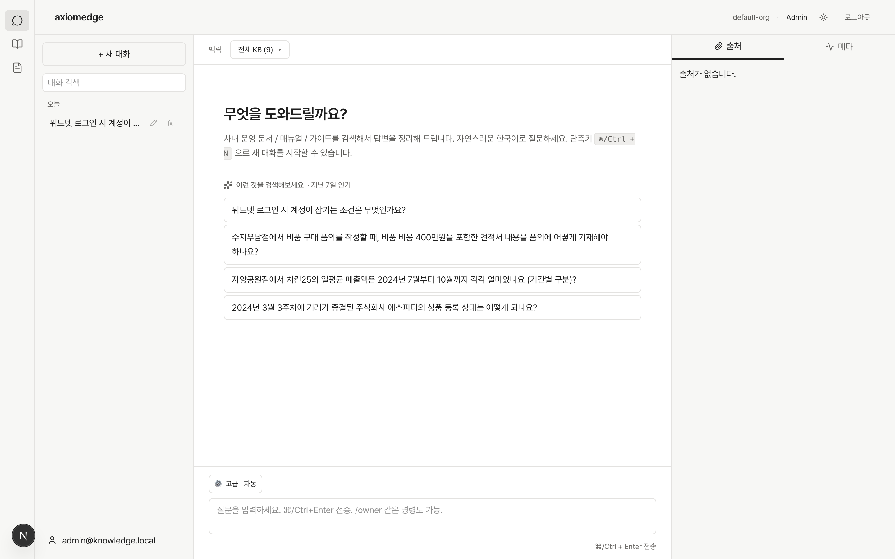
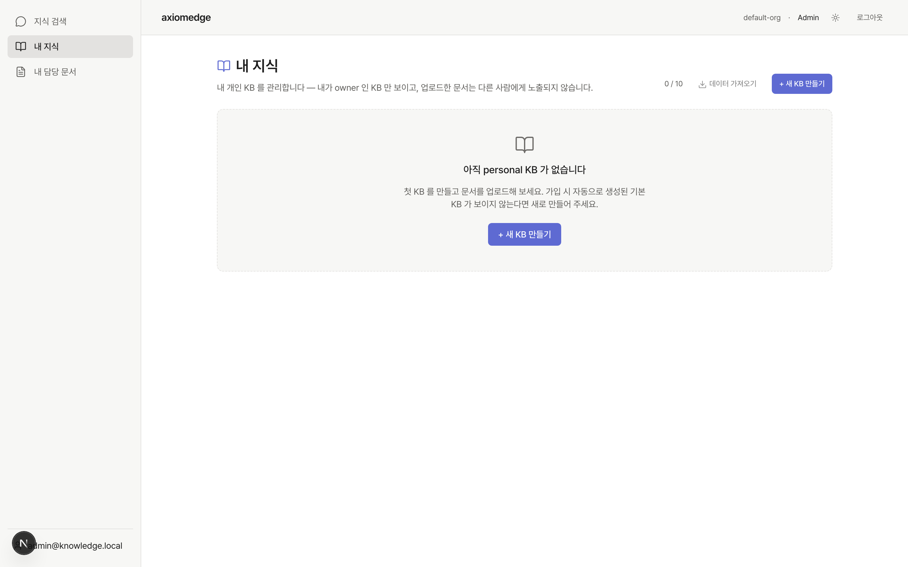
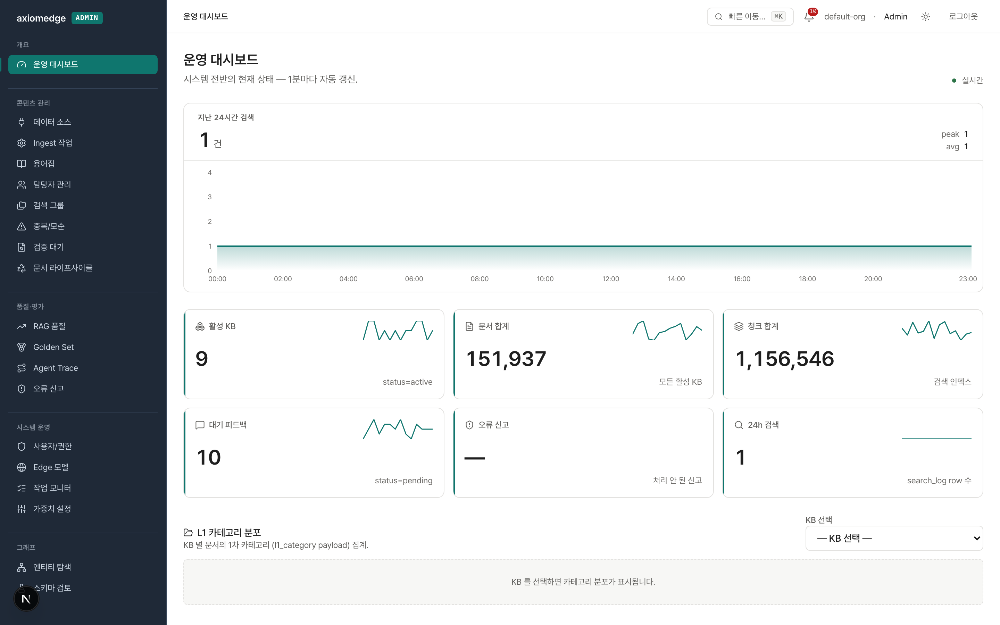
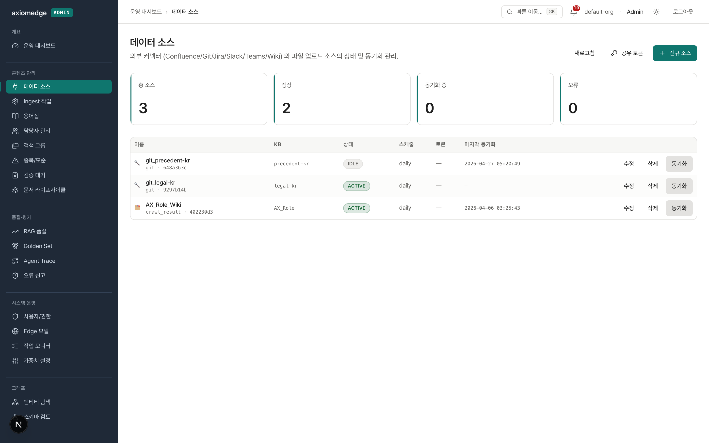
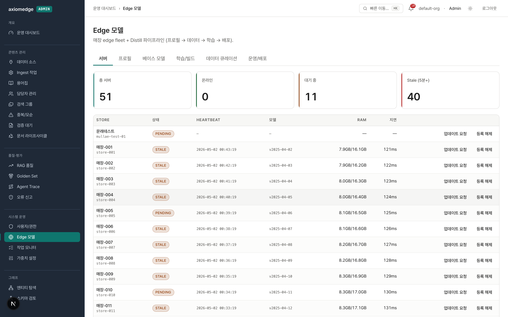
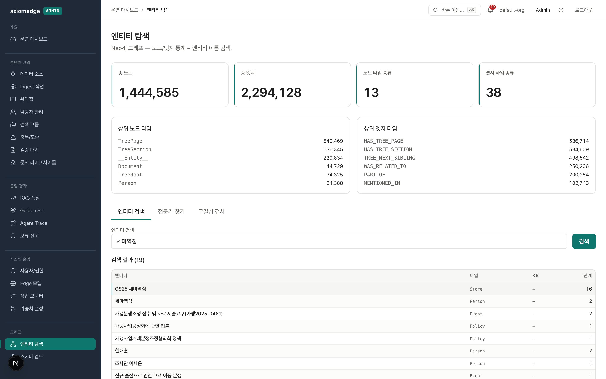
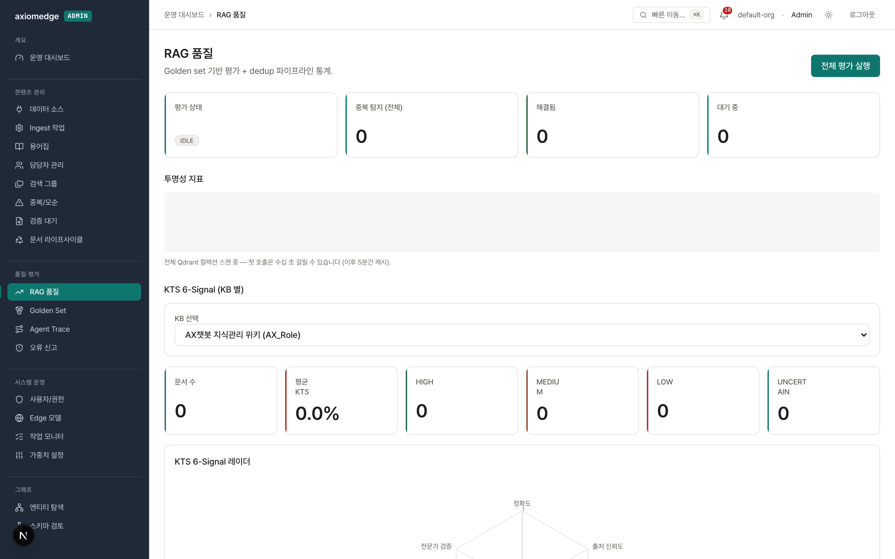

# axiomedge

> **한국어 사내 지식을 검색에서 답변, 그리고 매장 엣지 추론까지 하나의 운영 파이프라인으로 잇는 GraphRAG 플랫폼.**

대기업의 사내 위키 / 정책 문서 / 가맹점 운영 매뉴얼처럼 **수십~수백만 페이지** 의 한국어 텍스트를 안정적으로 다루도록 설계됐습니다. ChatGPT 류 범용 RAG 가 잡지 못하는 도메인 특수성 (가맹분쟁 판례 인용, 매장 운영 절차의 step-by-step, KB 별 권한·보존 정책) 을 위해 9-stage 검색 + GraphRAG 엔티티 확장 + 매장 엣지 distill 까지 한 파이프라인으로 묶었습니다.

## 사용자 화면

사용자는 자연어 질문 → 답변 + 출처 + 추론 메타 한 화면에서. KB 범위 / 모드 (auto/quick/deep) 선택, 대화 히스토리 사이드바, 빠른 추천 질의 (지난 7일 인기) 까지.



내가 만든 KB / 내가 owner 인 문서 / 내 활동 / 피드백 / 보안 (개인정보 처리방침 + PIPA §37 동의 철회) 까지 5 페이지로 한 명의 사용자 entire surface area 커버.



## 운영 화면 (admin)

19개 페이지를 5 카테고리로 — 운영 한눈에 + 콘텐츠 / 품질 / 시스템 / 그래프.

**대시보드** — 24h 검색 시계열 + KB·문서·청크·피드백·오류 신고·검색 6 카드 + KB 별 L1 카테고리 분포



**데이터 소스** — Confluence / Git / Jira / Slack / Teams / Wiki / 파일 업로드 connector + organization-wide bot token 관리 + 동기화 트리거 + 마지막 동기화 시각



**Edge 모델** — 매장 엣지 fleet (서버 51대 등록) + 6 탭 (서버 / 프로필 / 베이스 모델 / 학습·빌드 / 데이터 큐레이션 / 운영·배포)



**그래프 엔티티 탐색** — Neo4j 1.4M 노드 / 2.3M 엣지 통계 + 자연어 검색 → 노드 클릭 → 1-hop 이웃 그래프 인터랙티브 탐색 (multi-hop history 지원)



**RAG 품질** — Golden Set 평가 결과 + 중복 탐지 + KB 별 KTS 6-Signal radar (정확도 / 출처 신뢰도 / 신선도 / 일관성 / 사용자 피드백 / 전문가 검증) + 평가 메트릭 시계열



전 페이지 다크 모드 + 태블릿/모바일 반응형 + WCAG AA 통과 (axe-core 0 violation).

---

## 한 눈에 보는 차별점

| 구간 | 흔한 RAG | axiomedge |
|------|----------|-----------|
| **검색** | 단일 dense + 옵션 rerank | dense + sparse + identifier + 날짜/주차/일자 + 키워드 boost + 문서 다양성 + cross-encoder + composite rerank (엔티티 boost) |
| **추론** | LLM 단일 호출 | classify → expand → search → CRAG 자기검증 → 환각 가드 (계층형 응답) |
| **그래프** | 옵션 / 후처리 | GraphRAG 엔티티·관계 추출 + Neo4j 1-hop 확장 (정책↔매장↔담당자 cross-ref) |
| **인제스트** | 한 번 실행 | 2-stage + JSONL checkpoint (crash-safe) + content-hash incremental |
| **OCR** | API 호출 | 도메인 사전 + 초성 fuzzy 한글 보정 (PaddleOCR 결과 후처리) |
| **모델 운영** | API 만 | 클라우드 (TEI/SageMaker/PaddleOCR EC2) ↔ 로컬 (Ollama/ONNX/PaddleOCR-local) flag-flip 즉시 전환 |
| **엣지** | 없음 | QA 큐레이션 → LoRA SFT → GGUF 양자화 → S3 manifest → llama.cpp 매장 엣지 self-update |
| **품질 보호** | 단위 테스트 | unit 5,000+ + Playwright e2e 42 + axe-core a11y 0 violations |

---

## 핵심 아키텍처

```
                          ┌─────────────────────────────────┐
   사용자 질의            │                                 │
   (chat/검색)  ────────▶ │   FastAPI :8000                 │
                          │   ├── routes/ (138 endpoints)   │
                          │   ├── services (lifespan)       │
                          │   └── route_discovery (auto)    │
                          │                                 │
   admin (Next.js 16) ──▶ │                                 │
   사용자 web (B-1)        │                                 │
                          └────────┬───────┬───────┬────────┘
                                   │       │       │
                          ┌────────▼─┐ ┌───▼──┐ ┌──▼──────┐
                          │  Search  │ │Ingest│ │ Distill │
                          │ Pipeline │ │ 2-stg│ │ pipeline│
                          │ (9 step) │ │+chkpt│ │ (L+Q+D) │
                          └────┬─────┘ └──┬───┘ └────┬────┘
                               │          │          │
              ┌────────────────┼──────────┼──────────┼──────────────┐
              ▼                ▼          ▼          ▼              ▼
        ┌─────────┐      ┌─────────┐ ┌────────┐ ┌────────┐ ┌─────────────┐
        │ Qdrant  │      │  Neo4j  │ │PostgreSQL│ Redis │ │ TEI/SageMaker│
        │ (vec)   │      │ (graph) │ │ (meta)   │(cache)│ │  /Ollama     │
        └─────────┘      └─────────┘ └────────┘ └────────┘ └─────────────┘

        ┌──────────────────────────────────────────────────────────┐
        │ S3 manifest ──▶ Edge server (매장)                       │
        │                  └─ llama.cpp (CPU/GPU) + heartbeat     │
        └──────────────────────────────────────────────────────────┘
```

### 9-stage 검색 파이프라인

도메인 검색 품질을 위해 각 단계를 끊고 측정 가능하게 분리 (`docs/RAG_PIPELINE.md`).

| # | 단계 | 책임 |
|---|------|------|
| 1 | Cache | L1 (in-mem) → L2 (Redis) hit |
| 2 | Preprocess + Expand + Classify | 오타 보정, 시간 표현 해소, 동의어 확장, 의도 분류 |
| 3 | Embed | dense (BGE-M3 via TEI) + sparse |
| 4 | Qdrant Hybrid | RRF dense+sparse · identifier 매칭 (JIRA/CamelCase/파일명) · KB 다양성 · 문서 다양성 (max 5/doc + Jaccard dedup) · 날짜 필터 · 주차명 매칭 |
| 5 | Passage Cleaning | OCR 노이즈 제거, 도메인 사전 정정 |
| 6 | Cross-encoder Rerank | TEI bge-reranker-v2-m3 또는 로컬 cross-encoder |
| 7 | Composite Rerank | model 0.6 + base 0.3 + source 0.1 + entity boost (질의 매장명/사람명 chunk 가중) |
| 8 | Graph Expansion | Neo4j 1-hop 엔티티 보강 (CRAG 후보 보충) |
| 9 | Generate + Guard | LLM (SageMaker/Ollama) 답변 → CRAG self-judge → 환각 가드 |

### 2-stage 인제스트

문서 양이 많아 한 번에 처리하면 중간 실패 시 비용 폭발 — JSONL checkpoint 로 분리.

```
Stage 1 (parse)         Stage 2 (embed)
─────────────────       ──────────────────
file → parse/OCR  ───▶  JSONL checkpoint  ───▶  chunk → clean → embed → 4-stage dedup → Qdrant store
       (PaddleOCR)      (crash 시 resume)        (BGE-M3)        (exact / hash / similarity / cross-doc)
```

- **Incremental**: `src/cli/crawl.py` 가 `.crawl_state.json` 추적, `src/cli/ingest.py` 가 Qdrant `content_hash` 비교
- **Confluence**: `src/connectors/confluence/` BFS 병렬 + `CrawlResultConnector` → IngestionPipeline
- **OCR 보정**: `src/pipelines/processing/ocr_corrector.py` — 도메인 사전 + 초성 기반 fuzzy

### 엣지 모델 distill 파이프라인

매장 엣지 서버에서 사내 답변을 **오프라인 / 저비용** 으로 돌리기 위한 전용 파이프라인 (`docs/DISTILL.md`).

```
Profile (서버 그룹)  ──▶  데이터 큐레이션 (QA 생성 + consistency + 범용성 + augmentation 검증)
                         │
                         ▼
                    LoRA SFT (EXAONE / Gemma 베이스 모델 레지스트리)
                         │
                         ▼
                    GGUF 양자화 (q4_k_m / q5_k_m) + SHA256
                         │
                         ▼
                    S3 manifest 배포
                         │
                         ▼
                    매장 엣지 서버 (llama.cpp + heartbeat + self-update)
```

- **베이스 모델 레지스트리**: 상업/조건부/검증 상태별 라벨, default 정책
- **빌드 executor**: generate→train→quantize→evaluate→deploy 단일 orchestrator
- **크로스 플랫폼 설치**: Linux / Windows / macOS (`deploy/edge/install.sh|ps1`)

### 클라우드/로컬 전환 (flag-flip)

| 컴포넌트 | 환경 변수 | 클라우드 | 로컬 fallback |
|---------|-----------|----------|---------------|
| Embedding | `USE_CLOUD_EMBEDDING=true` | TEI (`BGE_TEI_URL`) | Ollama → ONNX |
| Reranker | `RERANKER_TEI_URL` | TEI (bge-reranker-v2-m3) | local cross-encoder |
| LLM | `USE_SAGEMAKER_LLM=true` | SageMaker (EXAONE) | Ollama |
| OCR | `PADDLEOCR_API_URL` | EC2 on-demand (`PADDLEOCR_INSTANCE_ID`) | 로컬 PaddleOCR |

---

## 빠른 시작

```bash
# 1) 의존성 + 인프라
make setup            # uv sync
make start            # docker compose: Postgres / Qdrant / Neo4j / Redis

# 2) 백엔드 + 프론트
make api              # FastAPI :8000
cd src/apps/web && pnpm install
make web-dev          # Next.js :3000 (사용자 web — B-1)
make dashboard        # Streamlit :8501 (admin/legacy — B-2 이식 진행 중)

# 3) 첫 인제스트
make ingest ARGS="--source ./docs/ --kb-id my-kb"

# 4) 테스트
make test-unit                                # ~5,000 tests, ~50s
cd src/apps/web && pnpm test                  # vitest 74
cd src/apps/web && pnpm test:e2e:admin        # Playwright 42 (backend 기동 필요)
```

상세는 [`docs/QUICKSTART.md`](docs/QUICKSTART.md) (30분 온보딩).

---

## admin 페이지 전체 목록 (19)

| 카테고리 | 페이지 |
|---------|--------|
| 개요 | 운영 대시보드 |
| 콘텐츠 관리 | 데이터 소스 · Ingest 작업 · 용어집 (223k) · 담당자 · 검색 그룹 · 중복/모순 · 검증 대기 · 라이프사이클 |
| 품질·평가 | RAG 품질 (KTS 6-Signal) · Golden Set · Agent Trace · 오류 신고 |
| 시스템 운영 | 사용자/권한 (사용자 / KB 권한 / ABAC) · Edge 모델 (6 탭) · 작업 모니터 · 가중치 설정 |
| 그래프 | 엔티티 탐색 · 스키마 검토 |

---

## 품질 / 안정성 베이스라인

- **5,000+ unit tests** (`tests/unit/`, ~50s) — 핵심 로직 회귀 보호
- **74 vitest** (`src/apps/web/tests/unit/`) — UI 컴포넌트 + 훅
- **42 Playwright e2e** (`src/apps/web/tests/e2e/admin/`) — 19 페이지 smoke + 22 인터랙션 + 1 mutation, **2.5분 단일 명령**
- **0 axe-core violation** — light/dark, admin/user 양쪽
- **5 분 in-memory cache** — 173k Qdrant scroll / 223k 용어 RapidFuzz 같은 무거운 집계
- **graceful cascade fallback** — 외부 의존성 (Qdrant/Neo4j/Ollama) 부분 실패 시도 dashboard 가 0 으로 렌더 (전체 5xx 안 됨)
- **데이터 격리**: org → KB → user role 3단 권한 + ABAC 정책

---

## 구성 요소

```
src/
├── api/              FastAPI 라우트 (138 endpoints) + helpers + AppState
├── pipelines/        2-stage 인제스트 (parse → checkpoint → embed → dedup → store)
│   └── graphrag/     엔티티·관계 추출 + Neo4j persistence
├── search/           9-stage 검색 + composite rerank + similarity matcher
├── connectors/       Confluence / Git / Slack / Wiki / 파일 업로드
├── distill/          엣지 모델 파이프라인 (data_gen + LoRA + GGUF + S3 deploy)
│   └── repositories/ profile / build / training_data / edge_log / edge_server
├── edge/             매장 엣지 서버 (llama.cpp + heartbeat + self-update)
├── stores/           Postgres / Qdrant / Neo4j / Redis 어댑터
├── auth/             user / role / KB 권한 / ABAC / IdP 동기화
├── nlp/              embedding / LLM provider + Korean NLP (KiwiPy + KSS)
├── core/             providers (registry + Protocol) + observability (tracing)
├── apps/
│   ├── web/          Next.js 16 사용자 + admin web (Tailwind v4)
│   └── dashboard/    Streamlit admin (B-2 이식 진행 중)
└── cli/              ingest / crawl / eval CLI
```

---

## 문서

| 영역 | 문서 |
|------|------|
| 시작 | [QUICKSTART](docs/QUICKSTART.md) (30분), [GLOSSARY](docs/GLOSSARY.md) (도메인 용어) |
| 아키텍처 | [ARCHITECTURE](docs/ARCHITECTURE.md), [DATA_MODEL](docs/DATA_MODEL.md), [DEVELOPMENT](docs/DEVELOPMENT.md) |
| 파이프라인 | [RAG_PIPELINE](docs/RAG_PIPELINE.md) (9단계), [INGESTION_PIPELINE](docs/INGESTION_PIPELINE.md) (2-stage), [GRAPHRAG](docs/GRAPHRAG.md) |
| 운영 | [DISTILL](docs/DISTILL.md), [DISTILL_TOOLCHAIN](docs/DISTILL_TOOLCHAIN.md), [DEPLOYMENT](docs/DEPLOYMENT.md), [OPS](docs/OPS.md) |
| 보안/연결 | [SECURITY](docs/SECURITY.md), [CONFLUENCE_CRAWLER](docs/CONFLUENCE_CRAWLER.md), [WEB](docs/WEB.md) |
| 참고 | [API](docs/API.md) (138 endpoints), [CONFIGURATION](docs/CONFIGURATION.md), [TROUBLESHOOTING](docs/TROUBLESHOOTING.md), [TESTING](docs/TESTING.md) |
| 운영 개선 | [IMPROVEMENT_PLAN](docs/IMPROVEMENT_PLAN.md) — 진행 중 작업 체크리스트 |

---

## 기여

[CONTRIBUTING.md](CONTRIBUTING.md) — 개발 setup · 코드 스타일 (ruff py312 line=100) · async 컨벤션 · PR 절차 · 테스트 정책.

병렬 개발: `scripts/ops/aliases.sh` 의 `kl-new` / `kl-pr` / `kl-done` worktree 워크플로우.

---

## 라이선스

내부 프로젝트. 외부 공유 / 인용 전 보유사 컨택.
